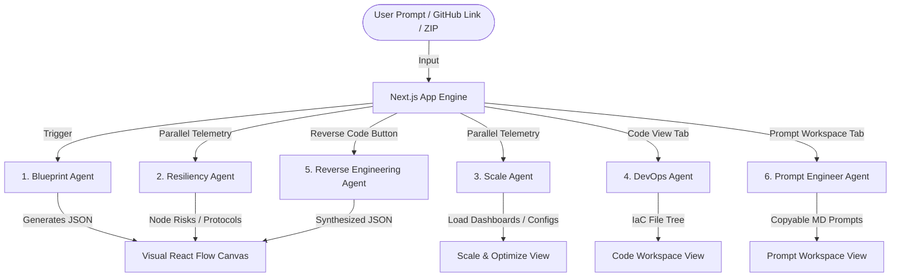

<!-- BEGIN:nextjs-agent-rules -->
# This is NOT the Next.js you know

This version has breaking changes — APIs, conventions, and file structure may all differ from your training data. Read the relevant guide in `node_modules/next/dist/docs/` before writing any code. Heed deprecation notices.
<!-- END:nextjs-agent-rules -->

# AI Multi-Agent Orchestration & Context Guide

This document describes the behaviors, boundaries, prompting guidelines, and data schemas of the specialized AI Agents operating within this system.

---

## 🤖 The Multi-Agent Ecosystem

The application coordinates six distinct AI agents, dividing architecture parsing, risk analysis, load sizing, infrastructure generation, codebase reverse-engineering, and progressive prompt compiling into dedicated pipelines.



---

## 📑 Agent Data Schemas & Prompting Rules

### 1. Blueprint Agent (`/api/generate` & `/api/modify-blueprint`)
* **Role**: Generates and modifies the Core 4-Tier Architecture layout.
* **Schema Contract**:
```json
{
  "explanation": "string (Short summary of the system and stack)",
  "blueprint": {
    "title": "string (Clean, professional system title)",
    "description": "string (System overview)",
    "layers": [
      {
        "id": "presentation" | "application" | "queue" | "data",
        "name": "string (Layer Title, e.g. Client Tier, Core Services)",
        "nodes": [
          {
            "id": "string (unique-kebab-case-id)",
            "name": "string (e.g. Booking API Gateway)",
            "type": "string (e.g. Node.js Express, Kafka, PostgreSQL)",
            "description": "string (Brief role description)"
          }
        ]
      }
    ],
    "steps": [
      {
        "id": "string (step-1)",
        "number": 1,
        "title": "string (Step title)",
        "description": "string (Data flow interaction)",
        "involved_nodes": ["string (involved node IDs)"]
      }
    ]
  }
}
```

### 2. Resiliency & Security Agent (`/api/analyze-resiliency`)
* **Role**: Scans nodes for SPOFs, assesses security, and classifies step communication types.
* **Schema Contract**:
```json
{
  "node_risks": [
    {
      "node_id": "string (matches exact ID of a node in the blueprint)",
      "risk_level": "HIGH" | "MEDIUM" | "LOW",
      "risk_title": "string (Concise title of risk)",
      "solution": "string (Specific architectural or security solution)"
    }
  ],
  "step_flows": [
    {
      "step_number": 1,
      "flow_type": "sync" | "async" | "event",
      "technical_protocol": "HTTP" | "gRPC" | "AMQP" | "Websocket"
    }
  ]
}
```

### 3. Scale & Performance Agent (`/api/analyze-scale`)
* **Role**: Calculates load capability profiles (Small, Medium, Large tiers), cloud monthly budgets, and server-tuning scripts.
* **Schema Contract**:
```json
{
  "load_estimates": [
    {
      "tier": "Small" | "Medium" | "Large",
      "concurrent_users": "string",
      "requests_per_second": "string",
      "server_spec": "string"
    }
  ],
  "deploy_stages": [
    {
      "stage": "string (Stage 1 / Stage 2 / Stage 3)",
      "title": "string (Stage title)",
      "estimated_cost": "string",
      "pros": ["string"],
      "cons": ["string"],
      "roadmap": "string"
    }
  ],
  "optimization_configs": {
    "redis": "string (Redis high-performance config script)",
    "nginx": "string (Nginx ingress CDN proxy config script)",
    "postgres": "string (SQL postgres parameter tuning statements)"
  },
  "monitoring_checklist": ["string"]
}
```

### 4. DevOps Agent (`/api/generate-infrastructure-code`)
* **Role**: Generates functional, real IaC configurations and application boilerplate codes in the selected language stack (Go, Node.js, Python) and deployment runtime (Docker Compose, Kubernetes, Terraform).
* **Schema Contract**:
```json
{
  "explanation": "string (Architectural guide to directories and scripts)",
  "files": {
    "docker-compose.yml": "string (YAML configuration)",
    "src/server.js": "string (Source code boilerplate)",
    "README.md": "string (Deployment instructions)"
  }
}
```

### 5. Reverse Engineering Agent (`/api/reverse-engineer`)
* **Role**: Reconstructs diagram graphs from codebase structural analyses (ZIP static uploads or public GitHub recursive trees).
* **Process**: Scans `package.json`, `requirements.txt`, `go.mod`, `docker-compose.yml`, and `README.md` to extract dependencies, then formats the output into the **Blueprint Agent JSON Schema**.

### 6. Prompt Engineer Agent (`/api/generate-prompts`)
* **Role**: Slices designed blueprints and scaling context into at least 3 progressive development phases. Writes high-fidelity copyable Markdown prompts (with step-by-step target isolation and guardrails) for downstream AIs, accompanied by interactive Definition of Done (DoD) checklists.
* **Schema Contract**:
```json
{
  "explanation": "string (Development strategic overview)",
  "phases": [
    {
      "phase_number": number (e.g. 1),
      "title": "string (Phase title, e.g. Schema Setup)",
      "description": "string (Phase technical focus)",
      "target_nodes": ["string (Involved node IDs)"],
      "ai_role": "string (Downstream AI target persona)",
      "ai_instructions_prompt": "string (Comprehensive, detailed Markdown prompt for downstream generation)",
      "definition_of_done": ["string (Checklist verification items)"]
    }
  ]
}
```

---

## 💡 AI Prompt Engineering Guidelines
* **Keep Schemas Strict**: Ensure all API handlers specify `response_format: { type: "json_object" }` (for OpenAI/DeepSeek) or enforce JSON formatting instructions in the system prompt.
* **Stream-Friendly Output**: The frontend parses JSON incrementally during streaming using a custom robust partial parser (`parsePartialJson`). Prompts must output keys sequentially (e.g. layers first, then nodes, then steps) so that the visual canvas renders new elements in real-time as the stream arrives.
* **Dynamic Neon Highlight Telemetry**: When nodes are added or updated via `handleChatModify`, set the modified node IDs in `setNewlyModifiedNodeIds`. This lights up a beautiful emerald pulsing neon ring around the nodes for 4 seconds in the React Flow Canvas to signal changes.
* **Progressive Slicing & Token Exhaustion Guardrails (Agent 6)**:
  * When slicing a large blueprint (e.g., microservices architecture with 5+ nodes), avoid asking the downstream AI to implement the entire application in a single step.
  * Enforce the **Service-by-Service Focus** strategy: guide the downstream AI to implement one "master reference service" completely (fully realized DB models, routing, dependency injection, repository mocks, and unit tests) as a template, and then sequentially extend it to subsequent services.
  * Break development into at least 3 logical phases: Database/Schema/Models (Phase 1), Core Business APIs (Phase 2), and Integration/Async Queue/CDN/External Gateways (Phase 3).
* **Localization Policy (Agent 6)**:
  * Honor the selected user interface language (`th` or `en`).
  * If the user selects Thai (`th`), the system must output explanations, phase titles, descriptions, roles, and Definition of Done (DoD) checklists in clear, natural Thai.
  * The actual Markdown AI prompt (`ai_instructions_prompt`) should be structured in Thai for instructions and guardrails, but all technical specifications, code imports, class schemas, SQL scripts, variable naming, and configuration scripts must remain in English to avoid syntax issues.


