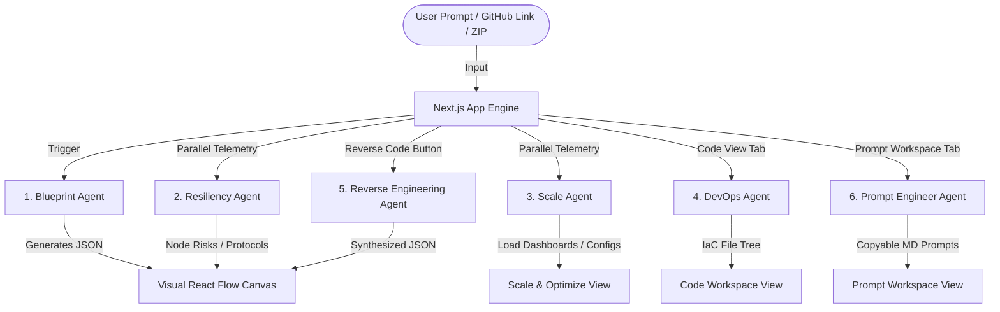

# 🌌 AI-Powered Workflow Designer

An advanced, premium-tier visual multi-agent platform designed to model, analyze, and automate production-grade software architectures. By combining **React Flow**, **Next.js 16**, **Tailwind CSS v4**, **WebSockets**, and **Redis**, it coordinates six specialized AI agents into a seamless workspace for real-time visual system design, resilience scanning, scaling analytics, DevOps code generation, codebase reverse engineering, and downstream progressive prompt synthesis.

---

## 🤖 The Multi-Agent Ecosystem

The engine orchestrates **six distinct, highly specialized AI agents** that parse architecture schemas, run parallel telemetry, analyze risks, generate production-ready IaC, reverse-engineer codebases, and slice prompts into development phases.



---

## 📑 Core Agent Directory & Schema Contracts

### 1. Blueprint Agent (`/api/generate` & `/api/modify-blueprint`)
* **Role**: Translates user requirements into a visual 4-Tier Core Architecture layout (Presentation, Application, Queue, Data).
* **Key Features**: Stream-friendly sequential JSON output, real-time rendering, and neon-highlighting modified nodes.

### 2. Resiliency & Security Agent (`/api/analyze-resiliency`)
* **Role**: Scans nodes for SPOFs (Single Point of Failure), evaluates network security, and classifies communication flows (`sync` | `async` | `event`).

### 3. Scale & Performance Agent (`/api/analyze-scale`)
* **Role**: Computes traffic loading capability profiles across Small/Medium/Large tiers, suggests monthly cloud budgets, and outputs custom parameter-tuning scripts (for Redis, Nginx, PostgreSQL).

### 4. DevOps Agent (`/api/generate-infrastructure-code`)
* **Role**: Autogenerates fully realized, runnable IaC (Infrastructure as Code) scripts (Docker Compose, Kubernetes, Terraform) and boilerplate source code matching the designed architecture.

### 5. Reverse Engineering Agent (`/api/reverse-engineer`)
* **Role**: Performs structural codebase dependency parsing on ZIP file uploads or public GitHub repository trees to reconstruct full interactive layout diagrams.

### 6. Prompt Engineer Agent (`/api/generate-prompts`)
* **Role**: Generates high-fidelity copyable Markdown prompts (with step-by-step target isolation and guardrails) to guide downstream code generation models through progressive implementation phases.

---

## 📡 Space-Age Collaboration Server

The project includes an advanced, low-latency multiplayer collaboration engine (`collab-server.js`) built with **WebSockets** and **Redis Pub/Sub** that supports real-time multiplayer cursor tracking, node dragging, and canvas presentation state synchronization.

### Collaboration Highlights:
* 🔒 **Secure HMAC Authentication**: Room access is dynamically authenticated with high-entropy cryptographic validation signatures.
* 🔄 **Redis Pub/Sub scaleout**: Seamlessly scales out horizontally across multiple process nodes when a `REDIS_URL` is set, falling back automatically to in-memory mode if Redis is offline.
* 🎨 **Cosmic Cursor Cursors**: Every client receives a custom randomly generated space-themed alias (e.g., `Obsidian Architect`, `Quantum Designer`) and signature color.
* 🎥 **Presenter Mode Synchronization**: Real-time presenter-to-client canvas synchronization.

---

## 🛠️ Tech Stack & Key Libraries

* **Framework**: [Next.js 16](https://nextjs.org/) (using the App Router with Next.js Agent Guidelines)
* **Styling**: [Tailwind CSS v4](https://tailwindcss.com/) with custom post-css compilation
* **Visual Canvas**: [@xyflow/react (React Flow)](https://reactflow.dev/) for high-performance reactive node-edge canvas rendering
* **Multiplayer Server**: [ws](https://github.com/websockets/ws) (Node.js WebSocket Server)
* **Caching & PubSub**: [redis](https://github.com/redis/node-redis) (Dynamically scaled cluster integration)
* **Robust JSON Streaming**: [jsonrepair](https://github.com/josdejong/jsonrepair) for parsing incoming incremental stream tokens

---

## 🚀 Getting Started

### 1. Prerequisites
Ensure you have Node.js installed on your machine (v18+ recommended) and optional access to a Redis instance for multiplayer horizontal scaling.

### 2. Installation
Clone the repository and install all dependencies:
```bash
git clone https://github.com/raiwaa475-art/AI-Powered-Workflow-Designer.git
cd AI-Powered-Workflow-Designer
npm install
```

### 3. Environment Setup
Create a `.env` or `.env.local` file in the root directory:
```env
# Agent Model Provider Keys (if using real LLMs)
OPENAI_API_KEY=your-openai-api-key
DEEPSEEK_API_KEY=your-deepseek-api-key

# Collaboration Secret Key (Must match client and server)
COLLAB_SECRET=your-secure-shared-secret-key
NEXT_PUBLIC_COLLAB_SECRET=your-secure-shared-secret-key

# Scale-out Multiplayer (Optional)
REDIS_URL=redis://localhost:6379
```

### 4. Running the Development Server
To launch both the Next.js development server and the WebSocket multiplayer collaboration server simultaneously:
```bash
npm run dev
```
* **Client App**: [http://localhost:3000](http://localhost:3000)
* **Multiplayer Server**: Runs locally on `ws://localhost:3002`

---

## 📁 Repository Structure

```
├── .antigravitycli/           # IDE / Agent CLI configurations
├── src/
│   ├── app/
│   │   ├── api/               # Server-side API endpoints for the 6 Agents
│   │   │   ├── analyze-resiliency/
│   │   │   ├── analyze-scale/
│   │   │   ├── generate-infrastructure-code/
│   │   │   ├── generate-prompts/
│   │   │   ├── generate/
│   │   │   ├── modify-blueprint/
│   │   │   ├── reverse-engineer/
│   │   │   └── ...
│   │   ├── globals.css        # Global CSS + Tailwind styling
│   │   ├── layout.tsx         # Root Layout
│   │   └── page.tsx           # Home Workspace Dashboard
│   ├── components/            # UI components (Canvas, Workspace, Chat, Sidebars)
│   ├── hooks/                 # Realtime Hooks (Collab, Generate, Session, Playback)
│   ├── lib/                   # Mock engines & auth structures
│   ├── types/                 # TypeScript typings
│   └── utils/                 # Utilities (Partial JSON Parser)
├── collab-server.js           # Realtime Multiplayer WebSocket & Redis Server
├── package.json               # Package setup
└── AGENTS.md                  # Comprehensive AI Multi-Agent specs & schemas
```

---

## 🛡️ License
Distributed under the MIT License. See `LICENSE` for more information.
