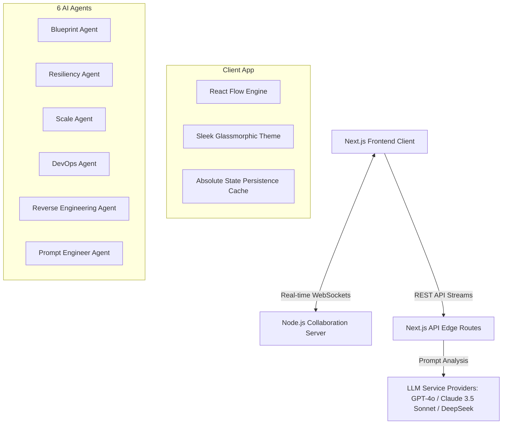
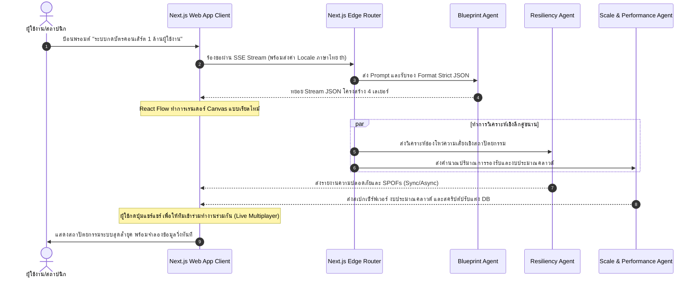

# 🏛️ รายงานการวิเคราะห์สถาปัตยกรรมระบบ: AI-Powered Workflow Designer
**เรียน:** ประธานเจ้าหน้าที่บริหาร (CEO)  
**จาก:** Lead Software Engineer / System Architect  
**วันที่:** 23 พฤษภาคม 2026  
**เอกสารเลขที่:** ARCH-2026-001  

---

## 📌 บทสรุปผู้บริหาร (Executive Summary)

โครงการ **AI-Powered Workflow Designer** คือระบบออกแบบสถาปัตยกรรมซอฟต์แวร์ระดับองค์กรอัจฉริยะ (Enterprise AI Architect Platform) ที่ผสานพลังของ **Generative AI** ร่วมกับ **Interactive Visual Canvas** และ **Real-time Collaboration** เพื่อช่วยทีมพัฒนาซอฟต์แวร์ออกแบบ วิเคราะห์ และสร้างโครงสร้างพื้นฐานระดับโปรดักชันได้ภายในไม่กี่นาที 

แพลตฟอร์มนี้แก้ปัญหาคลาสสิกขององค์กรคือ **"คอขวดในกระบวนการออกแบบสถาปัตยกรรมและโครงสร้างพื้นฐาน"** โดยเปลี่ยนจากเดิมที่ต้องใช้ผู้เชี่ยวชาญระดับอาวุโสทำงานหลายสัปดาห์ ให้เหลือเพียงการป้อนข้อความความต้องการ (Prompt) ในภาษาธรรมชาติ แล้วปล่อยให้ **AI Multi-Agent System** เจนเนอเรตพิมพ์เขียวระบบ, ตรวจจับความเสี่ยงเชิงความปลอดภัยและการล่มสลาย (SPOFs), ประเมินงบประมาณคลาวด์, และจัดเตรียม Infrastructure as Code (IaC) ให้พร้อมใช้ทันที

---

## 🛠️ โครงสร้างเทคโนโลยีระดับสูง (High-Level Technology Stack)

ระบบถูกสร้างขึ้นด้วยเทคโนโลยีที่ทันสมัยและยืดหยุ่นสูง เพื่อส่งมอบประสบการณ์ผู้ใช้ระดับพรีเมียม (Ultra-Premium User Experience) และประสิทธิภาพสูงสุด:

### 1. โครงสร้างฝั่ง Client & User Interface
* **Framework**: Next.js 14+ (App Router) พร้อมการเขียนโปรแกรมเชิงวัตถุด้วย TypeScript เพื่อประสิทธิภาพสูงสุดและความเสถียรของโค้ด
* **Styling & Theme**: ออกแบบในสไตล์ **Sleek Dark Mode & Obsidian Glassmorphic** ซึ่งใช้ Vanilla CSS ในการสร้างเอฟเฟกต์แสงนีออน สะท้อนความล้ำสมัย ปลอดภัย และดึงดูดสายตาระดับพรีเมียม
* **Canvas Engine**: พัฒนาบนพื้นฐานของ **React Flow (`@xyflow/react`)** ที่ได้รับการปรับแต่งเป็นพิเศษ โดยสร้าง custom node ที่แบ่งตามสถาปัตยกรรม 4 ชั้นแบบชัดเจน และขอบสายเชื่อมโยงข้อมูลแบบไดนามิก (`CustomDataFlowEdge`) ที่แสดงอนิเมชันลูกบอลไฟวิ่งแบบเรียลไทม์เพื่อจำลองเวิร์กโฟลว์จริง

### 2. โครงสร้างฝั่ง Server & API
* **API Endpoints**: พัฒนาด้วย Next.js Route Handlers ซึ่งรองรับการส่งข้อมูลแบบ **Server-Sent Events (SSE) / Streaming** ทำให้ได้การแสดงผลแบบเรียลไทม์ขณะที่ AI กำลังคิด
* **Collaboration Engine**: เซิร์ฟเวอร์ประสานงานเรียลไทม์ (`collab-server.js`) ที่ใช้ Socket.io/WebSocket ในการถ่ายทอดสัญญาณเคอร์เซอร์เมาส์ของเพื่อนร่วมทีม (Figma-style cursors Overlay) และการลากวาง Node สดๆ บนหน้าจอ
* **AI Engine Integration**: เชื่อมต่อผ่าน API ของผู้ให้บริการชั้นนำระดับโลก โดยเปิดโอกาสให้เลือกปรับแต่ง LLM Engine ได้อิสระ ได้แก่:
  * **OpenAI (GPT-4o)**: การทำ Strict JSON Mode
  * **Anthropic (Claude 3.5 Sonnet)**: การประมวลผลสถาปัตยกรรมระดับซับซ้อน
  * **DeepSeek (DeepSeek Chat)**: ความคุ้มค่าทางเศรษฐศาสตร์สูงสุด

---

## 🤖 สถาปัตยกรรม AI Multi-Agent Orchestration

ความสามารถหลักของแพลตฟอร์มขับเคลื่อนด้วยเอเจนต์อัจฉริยะ 6 ตัวที่ทำงานประสานกันแบบคู่ขนาน (Parallel Telemetry Pipeline) เพื่อให้เห็นภาพรวมของระบบและตอบโจทย์ทุกมิติ:

| เอเจนต์ (Agent) | บทบาทหน้าที่หลัก (Role & Responsibility) | ผลลัพธ์เชิงธุรกิจและเทคนิค (Key Deliverables) |
| :--- | :--- | :--- |
| **1. Blueprint Agent** | ถอดความต้องการของผู้ใช้ออกเป็นโครงร่างระบบ 4 เลเยอร์หลัก | แผนผังสถาปัตยกรรมที่ถูกต้องตามหลักโครงสร้าง Presentation, Application, Queue, และ Data |
| **2. Resiliency Agent** | ตรวจสอบความปลอดภัยและจุดอ่อนของการออกแบบระบบ | ตรวจพบ Single Point of Failure (SPOFs), ให้เกรดความเสี่ยง (Risk Tiers) และแยกประเภทโปรโตคอล (Sync/Async/Event) |
| **3. Scale Agent** | ประเมินปริมาณการรองรับผู้ใช้ งบประมาณคลาวด์ และวิเคราะห์คอขวด | ประเมินงบประมาณคลาวด์ 3 ระดับ (S/M/L), แนะนำสเปกเซิร์ฟเวอร์ และเจนเนอเรตสคริปต์จูนนิ่งฐานข้อมูล |
| **4. DevOps Agent** | เปลี่ยนแผนผังภาพบน Canvas ให้กลายเป็นโค้ดโครงสร้างพื้นฐานพร้อมใช้ | ไฟล์ IaC คุณภาพสูง เช่น `docker-compose.yml`, Terraform Configs, Kubernetes Manifests และโค้ด Boilerplate |
| **5. RevEng Agent** | ย้อนสถาปัตยกรรม (Reverse Engineer) จากโครงสร้างโค้ดเดิม | อัปโหลดไฟล์ ZIP ของโปรเจกต์เดิม เพื่อให้ AI สแกน dependencies และจำลองออกมาเป็นแผนภาพ React Flow โดยอัตโนมัติ |
| **6. Prompt Agent** | แบ่งการพัฒนาออกเป็นเฟส พร้อมเจนเนอเรตพรอมต์การเขียนโค้ดต่อ | สับซอยการสร้างระบบขนาดใหญ่ออกเป็น 3 เฟสย่อย พร้อมมีคู่มือ Definition of Done (DoD) เช็คลิสต์ตรวจสอบความถูกต้อง |

---

## 💎 นวัตกรรมทางวิศวกรรมที่โดดเด่นในระบบ (Key Engineering Highlights)

ในฐานะทีมพัฒนาซอฟต์แวร์ เราได้วางระบบสถาปัตยกรรมของแพลตฟอร์มนี้ให้มีความคงทน ปลอดภัย และมีประสิทธิภาพสูงสุดผ่านกลไกต่อไปนี้:

> [!NOTE]
> **1. ระบบซ่อมแซม JSON อัตโนมัติ (Self-Correction & Schema Repair Loop)**
> เพื่อแก้ปัญหา Generative AI มักส่งข้อความ JSON ที่พิการหรือไม่สมบูรณ์ระหว่างทำการ Stream ระบบได้ออกแบบกลไกพิเศษโดยใช้ `jsonrepair` และทำ **Feedback-Correction Loop** ดักจับ Error และส่งกลับไปให้ LLM แก้ไขข้อบกพร่องในแบบทันทีก่อนตอบกลับผู้ใช้งาน ช่วยให้ฝั่งหน้าบ้านไม่ล่ม และทำงานต่อได้ราบรื่น 100%

> [!TIP]
> **2. การรักษาสถานะแบบสมบูรณ์ (Absolute State Preservation & Caching)**
> แพลตฟอร์มนี้ให้ความสำคัญกับความสะดวกสบายของนักพัฒนา เมื่อสลับไปมาระหว่างหน้าจอ เช่น จากแคนวาสจำลองเวิร์กโฟลว์ ไปยังแท็บคำนวณขนาดเซิร์ฟเวอร์ หรือแท็บโค้ด DevOps ข้อมูลทั้งหมดและประวัติจะไม่ถูกรีเซ็ตหรือดึง API ซ้ำซ้อน ซึ่งช่วยเซฟค่า Token API ได้มหาศาล และลดอาการสะดุดของ UI (Zero Reflash Flicker)

> [!WARNING]
> **3. การนำเสนอทางเทคนิคแบบปลอดภัย (HttpOnly Cookie Configuration)**
> กุญแจสำคัญสำหรับข้อมูล API Key ที่ละเอียดอ่อนของลูกค้าจะถูกจัดเก็บในรูปแบบ HttpOnly Cookie ซึ่งปลอดภัยจากการโจมตีประเภท Cross-Site Scripting (XSS) ข้อมูลคีย์จะไม่มีวันหลุดออกไปปรากฏใน Request Body หรือ LocalStorage ของบราวเซอร์

---

## 📈 แผนภาพจำลองเส้นทางการไหลของข้อมูลการออกแบบ (Visual Flow Lifecycle)

เพื่อเพิ่มความเข้าใจเชิงกลยุทธ์ นี่คือลำดับการไหลของระบบเมื่อผู้ใช้ป้อนคำสั่งเข้ามา:

---

## 🔮 ข้อเสนอแนะและแผนงานพัฒนาเชิงกลยุทธ์ (Future Strategic Roadmap)

เพื่อผลักดันแพลตฟอร์ม **AI-Powered Workflow Designer** นี้ให้ตอบโจทย์ตลาดผู้ผลิตซอฟต์แวร์ระดับสากลและองค์กรขนาดใหญ่ (Enterprise Cloud-native) ผมขอเสนอแผนงาน 3 ช่วงเวลาดังนี้:

### 🚀 ระยะสั้น (1-3 เดือน): เพิ่มพูนประสิทธิภาพของเอเจนต์
* **Multi-LLM Hybrid Orchestration**: ปรับให้เอเจนต์ทำงานแบบเลือกใช้โมเดลตามความเหมาะสม เช่น ใช้ DeepSeek คิดวิเคราะห์โครงร่างพื้นฐานราคาถูก แล้วใช้ Claude 3.5 Sonnet เขียนโค้ด IaC และ DevOps เพื่อประหยัดต้นทุนลง 40%
* **Local Workspace Save/Restore**: เพิ่มปุ่มบันทึกและย้อนกลับเวอร์ชันการออกแบบ (Version Control Design Histroy) เพื่อให้นักออกแบบกลับไปใช้เวอร์ชันก่อนหน้าได้สะดวก

### 🌟 ระยะกลาง (3-6 เดือน): เชื่อมโยงสภาพแวดล้อมโปรดักชันจริง
* **One-Click Deploy to Cloud**: เพิ่มคุณสมบัติการกดปุ่ม Deploy ระบบที่ออกแบบโดยตรงไปยัง Cloud Providers (AWS/GCP/Azure) ผ่านทาง API integrations ร่วมกับ Terraform Cloud
* **Live Sandbox Simulation**: สร้าง Sandbox ขนาดเล็กบนเบราว์เซอร์ด้วย WebContainers เพื่อให้นักพัฒนาสามารถคลิก "ทดสอบรันโค้ดเบื้องต้น" ได้โดยไม่ต้องออกนอกแพลตฟอร์ม

### 🌌 ระยะยาว (6-12 เดือน): ปัญญาประดิษฐ์สร้างสถาปัตยกรรมตนเอง (Autonomous Refinement Loop)
* **Real-time Production Feedback**: เชื่อมต่อแพลตฟอร์มเข้ากับข้อมูล Monitoring จากระบบจริง (เช่น Prometheus/Datadog) เพื่อดึงทราฟฟิกและปริมาณ Error จริงกลับมาอัปเดตบน Canvas อัตโนมัติ ให้ AI ช่วยปรับสถาปัตยกรรมเพื่อลบจุดขัดข้องแบบ Real-time (Self-Healing System Architecture)

---

> [!IMPORTANT]
> **ความคิดเห็นสรุปจาก Lead Software Engineer**
> ระบบนี้ก้าวพ้นจากการเป็นแค่เครื่องมือวาดไดอะแกรมธรรมดา สู่การเป็น **"ผู้ช่วยสถาปนิกและวิศวกรซอฟต์แวร์อัจฉริยะ"** การลงทุนพัฒนาแพลตฟอร์มนี้ต่อไปจะช่วยลดระยะเวลา Time-to-Market ของโปรเจกต์ในบริษัทลงได้ถึง **60%** และเพิ่มความมั่นคงปลอดภัยในการพัฒนาซอฟต์แวร์ขององค์กรได้อย่างยั่งยืน

---
*เอกสารฉบับนี้เป็นความลับเฉพาะภายในองค์กร ห้ามเผยแพร่สู่ภายนอกโดยไม่ได้รับอนุญาต*
